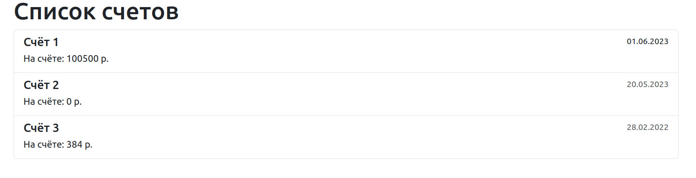
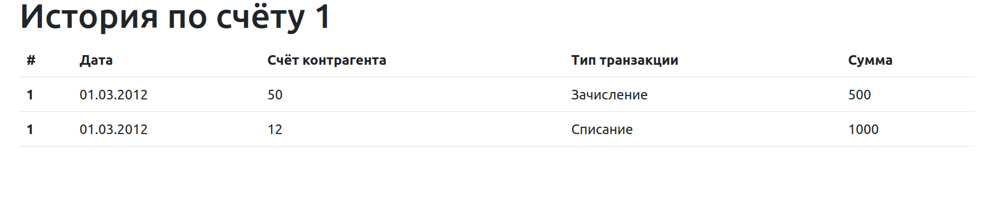

# Система учета финансов

Задачи системы учета финансов:

- хранение актуального состояния счетов
- хранение истории изменения счетов,
- возможность получения отчетов по изменениям счетов за период

## Визуальная схема фронтенда

Визуальная схема фронтенда списка счетов:

Визуальная схема фронтенда истории по счету:

